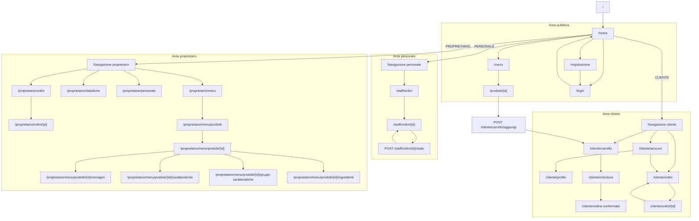
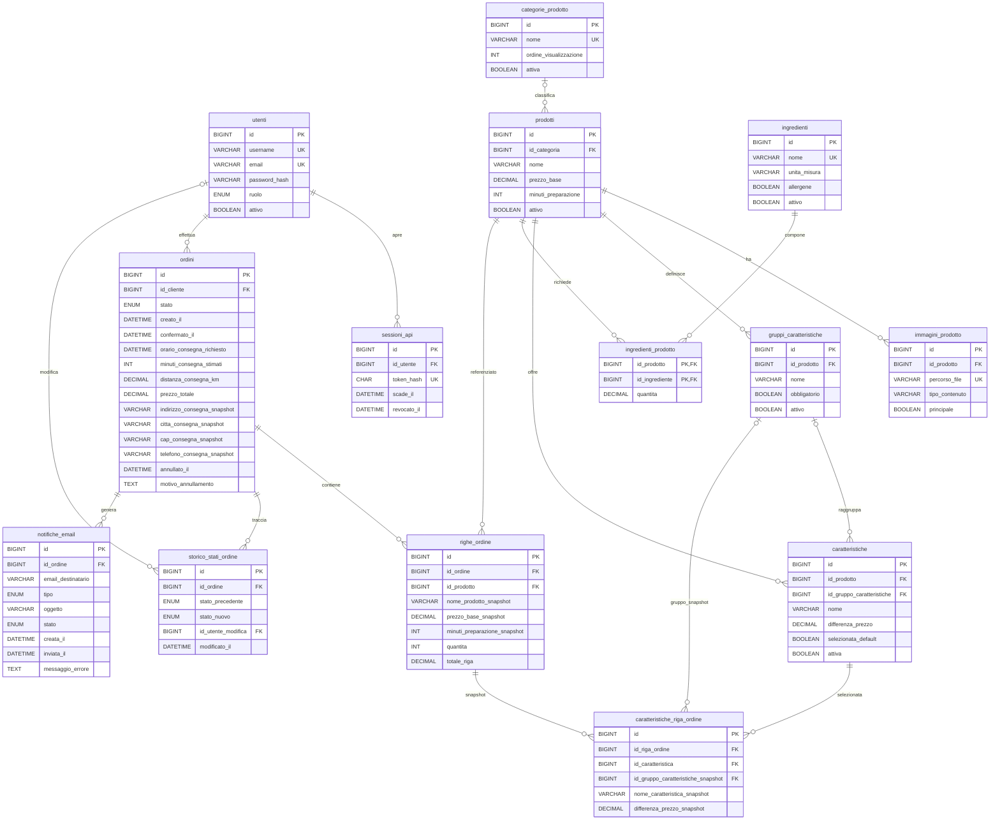

<div align="center">
  
  <p><strong><big><big><big>Università degli Studi dell'Aquila</big></big></big></strong></p>
  <p><strong><big>Corso di Web Engineering [DT0180]</big></strong></p>
  <p><strong><big>A.A. 2025/2026</big></strong></p>
</div>

---

<div align="center">

<p>
  <strong><big><big><big>MasterEat Web Application - Documentazione</big></big></big></strong>
</p>

<p>
  <strong>Repository ufficiale:
  <a href="https://github.com/odoardy/MasterEat.git">https://github.com/odoardy/MasterEat.git</a></strong>
</p>

<p><strong>Membri del team:</strong></p>

<table>
  <thead>
    <tr>
      <th>Studente</th>
      <th>Matricola</th>
    </tr>
  </thead>
  <tbody>
    <tr>
      <td>Davide Odoardi</td>
      <td>292216</td>
    </tr>
    <tr>
      <td>Alessandro Marinucci</td>
      <td>261682</td>
    </tr>
    <tr>
      <td>Antonino Campellone</td>
      <td>292594</td>
    </tr>
  </tbody>
</table>

</div>

---

## Contributi dei membri del gruppo

Il progetto è stato sviluppato in collaborazione tra tutti i membri del gruppo. Le aree indicate rappresentano i contributi prevalenti, non una separazione esclusiva delle attività svolte.

| Membro | Contributo prevalente |
| --- | --- |
| **Davide Odoardi** | Architettura complessiva del progetto, sviluppo backend e integrazione delle componenti della web application e dei servizi RESTful. |
| **Antonino Campellone** | Interfaccia web, template HTML/FreeMarker e rifinitura del layout CSS responsive. |
| **Alessandro Marinucci** | Schema dati, predisposizione dei contenuti demo e supporto ai test funzionali. |

Le principali scelte progettuali e le verifiche finali sono state discusse congiuntamente dal gruppo.

## 1. Introduzione

MasterEat è una web application server-side per la gestione di un'attività di ristorazione e consegna. La parte Web Engineering offre pagine HTML renderizzate dal server per consultare il menù, registrarsi, autenticarsi, comporre un carrello, completare il checkout e gestire gli ordini secondo il ruolo dell'utente.

Il progetto complessivo contiene anche una parte RESTful, pubblicata sotto `/api/*` e documentata separatamente in `docs/DocumentazioneSWA.md`. Questa relazione riguarda la parte WE: servlet, template FreeMarker, sessione HTTP, form tradizionali, viste responsive e flussi operativi per cliente, personale e proprietario.

## 2. Obiettivi della parte Web Engineering

La parte WE realizza un'applicazione navigabile direttamente da browser, senza framework frontend. Gli obiettivi principali sono:

- rendering HTML server-side tramite FreeMarker;
- navigazione pubblica per home, menù, ricerca e dettaglio prodotto;
- autenticazione e logout tramite sessione HTTP;
- area cliente con account, profilo, carrello, checkout e storico ordini;
- area personale per consultazione ordini operativi e avanzamento stato;
- area proprietario per ordini, statistiche, personale, menù, prodotti, immagini, caratteristiche e ingredienti;
- validazione lato client come supporto UX e validazione server-side come controllo decisivo;
- accessibilità, responsive design, compatibilità con browser moderni e degradazione senza JavaScript;
- documentazione tecnica con navigation diagram e schema relazionale.

## 3. Tecnologie e dipendenze

Le tecnologie riportate derivano da `MasterEat/pom.xml`, `WEB-INF/web.xml`, dagli asset web e dagli script SQL.

| Area | Tecnologia / dipendenza | Uso nel progetto |
| --- | --- | --- |
| Server | Java 17 | Versione impostata da `maven.compiler.release`. |
| Server | Maven WAR | Packaging dell'applicazione come WAR con `finalName` pari a `MasterEat`. |
| Server | Tomcat 11 | Ambiente di deploy previsto per Jakarta Servlet 6. |
| Server | Jakarta Servlet API 6.0.0 | Servlet, filter, multipart upload e sessioni HTTP. |
| Server | FreeMarker 2.3.34 | Rendering delle pagine WE da template classpath. |
| Server | Jersey 3.1.11 | Parte REST separata, mappata su `/api/*`. |
| Server | BCrypt | Hashing password tramite `org.mindrot:jbcrypt:0.4`. |
| Server | Jakarta Mail / Angus Mail 2.0.3 | Invio email SMTP locale di conferma e consegna ordine. |
| Database | MySQL | Database relazionale creato dagli script in `MasterEat/database/`. |
| Database | JNDI DataSource | Accesso JDBC tramite `java:comp/env/jdbc/MasterEatDB`. |
| Client | HTML5 | Struttura semantica delle pagine renderizzate. |
| Client | CSS | Layout responsive con Grid, Flexbox e media query. |
| Client | JavaScript vanilla | Menu mobile, conferme form, header dinamico e back-to-top. |
| Client | Nessun framework frontend | Non sono presenti React, Angular, Vue, Vite o librerie UI. |

## 4. Architettura generale

L'architettura WE segue un modello MVC server-side. I controller servlet ricevono richieste HTTP, leggono parametri e sessione, delegano la logica ai service, ottengono dati dai DAO e renderizzano template FreeMarker. I DAO JDBC lavorano su MySQL tramite il DataSource JNDI configurato nel container.

```text
Browser
  -> Servlet Controller
  -> Service
  -> DAO JDBC
  -> JNDI DataSource
  -> MySQL

Servlet Controller
  -> TemplateRenderer
  -> FreeMarker Template
  -> HTML Response
  -> Browser
```

I DTO sono usati anche per trasferire dati verso template e form senza esporre direttamente ogni dettaglio dei model. Le utility trasversali centralizzano rendering, sessione, carrello, password, email, upload immagini e connessione database.

## 5. Separazione tra WE e SWA

La parte riguardante la web application e la parte riguardante le API convivono nello stesso WAR, ma hanno superfici distinte:

| Aspetto | WE | SWA |
| --- | --- | --- |
| Base URL | Pagine come `/home`, `/menu`, `/cliente/*`, `/staff/*`, `/proprietario/*` | API JSON sotto `/api/*` |
| Stato autenticazione | Sessione HTTP e cookie del container | Token interno `Authorization: Bearer <token>` |
| Rendering | HTML server-side FreeMarker | JSON JAX-RS/Jersey |
| Client | Browser tradizionale con form HTML | Client statico `/swa-client/` o client REST esterni |
| Protezione cross-origin | Non esposta come API cross-origin | `CorsFilter` limitato a `/api/*` |

`CorsFilter` è annotato con `@WebFilter(filterName = "CorsFilter", urlPatterns = "/api/*")`. Aggiunge gli header CORS e risponde alle richieste `OPTIONS` solo per le API REST. La webapp session-based non passa da questo filtro e resta separata dal modello token della parte SWA.

## 6. Configurazione Tomcat, `web.xml` e DataSource JNDI

Il file `MasterEat/src/main/webapp/WEB-INF/web.xml` definisce gli elementi container-level:

- welcome file `index.html`, che reindirizza alla homepage `/home`;
- servlet Jersey `MasterEatApi`, caricata all'avvio e mappata su `/api/*`;
- resource-ref `jdbc/MasterEatDB` di tipo `javax.sql.DataSource`;
- session timeout di 30 minuti;
- tracking della sessione tramite cookie.

I controller non sono elencati uno per uno in `web.xml` perché usano annotazioni `@WebServlet`. Il filtro di autenticazione usa analogamente `@WebFilter`.

`DatabaseConnectionFactory` recupera il DataSource con lookup JNDI su `java:comp/env/jdbc/MasterEatDB`. Le credenziali del database non sono nel codice: vanno configurate localmente in Tomcat, ad esempio in:

```text
$CATALINA_BASE/conf/Catalina/localhost/MasterEat.xml
```

Il MySQL Connector/J deve essere disponibile nella `lib` del Tomcat usato per creare il pool JNDI. La guida operativa con l'esempio XML completo resta in `MasterEat/database/README.md`.

## 7. Struttura directory WE

I percorsi principali della parte WE sono:

| Percorso | Contenuto |
| --- | --- |
| `MasterEat/src/main/java/it/univaq/mastereat/controller/web` | Servlet controller pubblici, cliente, staff, proprietario e servlet immagini. |
| `MasterEat/src/main/java/it/univaq/mastereat/controller/web/filter` | Filtro `AuthenticationFilter` per aree riservate WE. |
| `MasterEat/src/main/resources/templates` | Template FreeMarker caricati dal classpath. |
| `MasterEat/src/main/webapp/assets/css` | CSS base, layout, componenti, form, pagine e responsive. |
| `MasterEat/src/main/webapp/assets/js` | JavaScript vanilla globale. |
| `MasterEat/src/main/webapp/assets/img` | Logo, favicon e placeholder immagini. |
| `MasterEat/src/main/webapp/WEB-INF` | Configurazione web application. |
| `MasterEat/database` | Schema SQL, seed utenti e seed menù demo. |
| `docs` | Documentazione SWA/WE, OpenAPI e diagrammi. |

Le immagini prodotto caricate non vengono salvate dentro il repository: `ProductImageStorage` usa per default una directory esterna sotto la home utente, sovrascrivibile con system property.

## 8. Rendering FreeMarker e layout condiviso

`TemplateRenderer` è il punto unico di rendering della parte WE. Configura FreeMarker `2.3.34` con:

- `ClassTemplateLoader` su `/templates`;
- encoding UTF-8;
- output format HTML;
- riconoscimento delle estensioni standard;
- `TemplateExceptionHandler.RETHROW_HANDLER`.

Prima di renderizzare una pagina, il renderer arricchisce il model con dati comuni: `contextPath`, `requestUri`, anno corrente, utente autenticato, ruolo, label del ruolo e numero elementi del carrello per i clienti.

Il layout principale è `templates/layout.ftl`. Contiene funzioni comuni come `publicUrl`, `price` e `displayDate`, importa header e footer, include i CSS e il JavaScript con cache busting manuale tramite query string `?v=...`. Il layout usa `<html lang="it" class="no-js">`; il file `main.js` sostituisce `no-js` con `js` quando JavaScript è disponibile.

## 9. Autenticazione WE, sessioni e ruoli

L'autenticazione WE avviene su `/login` tramite `AuthWebController`. Dopo la verifica username/password con `AuthService`, il controller crea un `WebUserSession` e lo salva in sessione HTTP attraverso `SessionUtils.login`. Il metodo invalida una sessione precedente prima di creare quella nuova. Il logout su `/logout` invalida la sessione corrente.

Le password sono gestite da `PasswordHasher`: `AuthService` verifica gli hash salvati e `UtenteService` genera nuovi hash BCrypt durante registrazione cliente e creazione personale.

`AuthenticationFilter` protegge:

- `/cliente/*`, ammesso solo a ruolo `CLIENTE`;
- `/staff/*`, ammesso solo a ruolo `PERSONALE`;
- `/proprietario/*`, ammesso solo a ruolo `PROPRIETARIO`.

Se l'utente non è autenticato viene reindirizzato a `/login`; se è autenticato con ruolo errato viene restituito `403 Forbidden`. Questo modello è indipendente dalla sessione token SWA della tabella `sessioni_api`.

## 10. Navigation diagram



Il logout è disponibile dall'header in tutte le aree autenticate tramite `POST /logout`. L'operazione invalida la sessione HTTP corrente e reindirizza l'utente alla homepage `/home`.

Lo stesso diagramma è disponibile come file separato in `docs/diagrams/NavigationDiagram.mmd`.

## 11. Area pubblica

L'area pubblica consente l'accesso senza autenticazione alla home, al menù, al dettaglio prodotto, al login e alla registrazione cliente.

| Controller | Rotta | Metodo | Funzionalità |
| --- | --- | --- | --- |
| `HomeController` | `/home` | `GET` | Homepage con prodotti in evidenza caricati dal catalogo pubblico. |
| `MenuController` | `/menu` | `GET` | Menù completo per categorie. |
| `MenuController` | `/menu?q=&prezzoMin=&prezzoMax=` | `GET` | Ricerca prodotti per nome e fascia prezzo. |
| `MenuController` | `/prodotti/{id}` | `GET` | Dettaglio prodotto, immagini e caratteristiche selezionabili. |
| `AuthWebController` | `/login` | `GET`, `POST` | Form login e autenticazione WE. |
| `RegistrationController` | `/registrazione` | `GET`, `POST` | Registrazione nuovo cliente. |
| `RegistrationController` | `/register` | `GET` | Alias che reindirizza a `/registrazione`. |

La ricerca pubblica normalizza i parametri e valida i prezzi lato server. La registrazione valida username, password, email, telefono e dati di consegna prima di delegare la creazione utente al service.

## 12. Area cliente

L'area cliente usa sessione HTTP e carrello server-side. `CartSessionUtils` conserva nella sessione un `WebCart` e gestisce i flash message del carrello; prezzi, nomi prodotto, tempi di preparazione e caratteristiche vengono ricostruiti lato server, evitando di fidarsi dei valori ricevuti dal form.

| Rotta | Metodo | Funzionalità |
| --- | --- | --- |
| `/cliente/account` | `GET` | Dashboard cliente con dati account e ultimi ordini. |
| `/cliente/profilo` | `GET`, `POST` | Lettura e aggiornamento profilo. |
| `/cliente/ordini` | `GET` | Storico ordini con filtri stato e data. |
| `/cliente/ordini/{id}` | `GET` | Dettaglio ordine, righe e storico stati. |
| `/cliente/ordini/{id}/annulla` | `POST` | Annullamento se l'ordine è in stato annullabile. |
| `/cliente/carrello` | `GET` | Visualizzazione carrello. |
| `/cliente/carrello/aggiungi` | `POST` | Aggiunta prodotto configurato al carrello. |
| `/cliente/carrello/incrementa` | `POST` | Incremento quantità riga carrello. |
| `/cliente/carrello/decrementa` | `POST` | Decremento quantità riga carrello. |
| `/cliente/carrello/rimuovi` | `POST` | Rimozione di una configurazione. |
| `/cliente/carrello/svuota` | `POST` | Svuotamento carrello. |
| `/cliente/checkout` | `GET`, `POST` | Conferma ordine con data e ora consegna richiesta. |
| `/cliente/ordine-confermato` | `GET` | Pagina di conferma post-checkout. |

Il checkout richiede un orario di consegna, calcola il minimo ammesso in base al tempo stimato e valida che l'orario non superi la chiusura configurata nel service.

## 13. Area staff

L'area staff è dedicata al personale operativo. Mostra ordini lavorabili, dettaglio ordine, righe con preparazione/ingredienti e storico cambi.

| Rotta | Metodo | Funzionalità |
| --- | --- | --- |
| `/staff/ordini` | `GET` | Lista ordini operativi filtrabile per stato. |
| `/staff/ordini/{id}` | `GET` | Dettaglio ordine operativo, righe e storico. |
| `/staff/ordini/{id}/stato` | `POST` | Avanzamento progressivo allo stato successivo. |

Gli stati visibili allo staff sono `INSERITO`, `IN_PREPARAZIONE`, `PRONTO` e `IN_CONSEGNA`. Il service calcola il prossimo stato ammesso, impedendo salti arbitrari. I risultati delle operazioni vengono riportati all'utente con flash message in sessione.

## 14. Area proprietario

L'area proprietario offre funzioni di controllo e manutenzione del catalogo.

| Rotta | Metodo | Funzionalità |
| --- | --- | --- |
| `/proprietario/ordini` | `GET` | Monitoraggio ordini con filtri per stato e intervallo date. |
| `/proprietario/ordini/{id}` | `GET` | Dettaglio ordine, righe, storico e operatori. |
| `/proprietario/statistiche` | `GET` | Statistiche giornaliere filtrabili per data. |
| `/proprietario/personale` | `GET`, `POST` | Lista personale e creazione nuovo membro staff. |
| `/proprietario/personale/nuovo` | `GET` | Form creazione staff. |

Gestione menù e prodotti:

| Rotta | Metodo | Funzionalità |
| --- | --- | --- |
| `/proprietario/menu` | `GET` | Vista riepilogativa catalogo proprietario. |
| `/proprietario/menu/prodotti` | `GET`, `POST` | Lista prodotti e creazione prodotto. |
| `/proprietario/menu/prodotti/nuovo` | `GET` | Form nuovo prodotto. |
| `/proprietario/menu/prodotti/{id}` | `GET` | Dettaglio prodotto. |
| `/proprietario/menu/prodotti/{id}/modifica` | `GET`, `POST` | Modifica prodotto. |

Le categorie prodotto attive già presenti nello schema e nei dati possono essere assegnate ai prodotti durante creazione e modifica. Non è prevista una pagina autonoma di gestione categorie.

Gestione immagini:

| Rotta | Metodo | Funzionalità |
| --- | --- | --- |
| `/proprietario/menu/prodotti/{id}/immagini` | `GET`, `POST` | Lista e upload immagini. |
| `/proprietario/menu/prodotti/{id}/immagini/{idImmagine}/principale` | `POST` | Selezione immagine principale. |
| `/proprietario/menu/prodotti/{id}/immagini/{idImmagine}/rimuovi` | `POST` | Rimozione immagine. |

Gestione caratteristiche e gruppi:

| Rotta | Metodo | Funzionalità |
| --- | --- | --- |
| `/proprietario/menu/prodotti/{id}/caratteristiche` | `GET`, `POST` | Lista e creazione caratteristiche. |
| `/proprietario/menu/prodotti/{id}/caratteristiche/nuova` | `GET` | Form nuova caratteristica. |
| `/proprietario/menu/prodotti/{id}/caratteristiche/{idCaratteristica}/modifica` | `GET`, `POST` | Modifica caratteristica. |
| `/proprietario/menu/prodotti/{id}/caratteristiche/{idCaratteristica}/rimuovi` | `POST` | Disattivazione caratteristica. |
| `/proprietario/menu/prodotti/{id}/gruppi-caratteristiche` | `GET`, `POST` | Lista e creazione gruppi. |
| `/proprietario/menu/prodotti/{id}/gruppi-caratteristiche/nuovo` | `GET` | Form nuovo gruppo. |
| `/proprietario/menu/prodotti/{id}/gruppi-caratteristiche/{idGruppo}/modifica` | `GET`, `POST` | Modifica gruppo. |
| `/proprietario/menu/prodotti/{id}/gruppi-caratteristiche/{idGruppo}/rimuovi` | `POST` | Disattivazione gruppo. |

Gestione ingredienti:

| Rotta | Metodo | Funzionalità |
| --- | --- | --- |
| `/proprietario/menu/prodotti/{id}/ingredienti` | `GET`, `POST` | Lista e associazione ingrediente al prodotto. |
| `/proprietario/menu/prodotti/{id}/ingredienti/nuovo` | `GET` | Form nuovo ingrediente o associazione da catalogo. |
| `/proprietario/menu/prodotti/{id}/ingredienti/{idIngrediente}/modifica` | `GET`, `POST` | Modifica ingrediente associato. |
| `/proprietario/menu/prodotti/{id}/ingredienti/{idIngrediente}/rimuovi` | `POST` | Rimozione associazione ingrediente-prodotto. |

## 15. Flussi applicativi principali

1. Registrazione e login: l'utente compila il form di registrazione, il controller valida i dati, `UtenteService` crea il cliente con password BCrypt, quindi il login crea una sessione HTTP con `WebUserSession`.
2. Consultazione menù e aggiunta al carrello: l'utente apre `/menu` o `/prodotti/{id}`, seleziona quantità e caratteristiche, il server valida che le caratteristiche siano attive e coerenti con il prodotto, quindi inserisce una riga nel carrello di sessione.
3. Checkout cliente: il cliente apre `/cliente/checkout`, sceglie data/ora consegna, il server ricostruisce le righe da dati persistenti, valida orario e configurazioni, crea l'ordine confermato e svuota il carrello.
4. Avanzamento stato staff: il personale apre la lista ordini, entra nel dettaglio e usa l'azione di avanzamento; il service consente solo la transizione progressiva successiva.
5. Gestione menù proprietario: il proprietario gestisce prodotti, immagini, gruppi caratteristiche, caratteristiche e ingredienti tramite form server-side con validazioni dedicate.

## 16. Gestione stati ordine

Gli stati dell'ordine sono definiti dallo schema SQL e dal model `StatoOrdine`:

- `BOZZA`;
- `INSERITO`;
- `IN_PREPARAZIONE`;
- `PRONTO`;
- `IN_CONSEGNA`;
- `CONSEGNATO`;
- `ANNULLATO`.

Il flusso operativo progressivo è:

```text
INSERITO -> IN_PREPARAZIONE -> PRONTO -> IN_CONSEGNA -> CONSEGNATO
```

`BOZZA` rappresenta un ordine non ancora confermato. `INSERITO` è l'ordine confermato dal cliente. Gli stati intermedi rappresentano cucina e consegna. `ANNULLATO` è una cancellazione logica.

L'annullamento non elimina fisicamente il record: aggiorna stato, data e motivo annullamento, preservando tracciabilità e storico. Le righe ordine e le caratteristiche selezionate contengono snapshot di nome, prezzo, tempo e differenze prezzo, così lo storico resta leggibile anche se il catalogo viene modificato dopo l'ordine.

## 17. Upload immagini prodotto

L'upload immagini è gestito da `OwnerMenuController` con:

```java
@MultipartConfig(maxFileSize = 3145728L, maxRequestSize = 4194304L)
```

La dimensione massima del file è 3 MB; la request multipart è limitata a 4 MB. `ImmagineProdottoService` accetta MIME type `image/jpeg`, `image/png`, `image/webp` e `image/gif`, controlla file vuoto e lunghezza del testo alternativo, genera un nome non prevedibile con UUID e salva il file attraverso `ProductImageStorage`. La validazione MIME si basa sul content type dichiarato dal multipart.

I metadati sono registrati in `immagini_prodotto`, mentre il file binario sta su storage esterno. L'URL pubblico segue il formato:

```text
/uploads/prodotti/{idProdotto}/{nomeFileSalvato}
```

`ProductImageFileServlet` serve questi file. `ProductImageStorage.resolveForServing` normalizza il path, accetta solo due segmenti, richiede id prodotto positivo e nome file sicuro, verifica che il path risolto resti sotto la directory base e rifiuta traversal. Se un'immagine viene caricata come principale o è la prima immagine del prodotto, il DAO mantiene coerente il flag `principale`. In assenza di immagine, i template usano il placeholder `assets/img/placeholders/meal.svg`.

## 18. Notifiche email con FakeSMTP

Le notifiche email sono gestite da `EmailNotificationService` e registrate nella tabella `notifiche_email`. L'invio effettivo passa da `MailSender`, mentre `EmailConfig` legge configurazione SMTP da system property o variabili d'ambiente. I tipi previsti sono:

- `ORDINE_CONFERMATO`;
- `ORDINE_IN_CONSEGNA`.

Gli stati della notifica sono:

- `DA_INVIARE`;
- `INVIATA`;
- `FALLITA`.

L'invio è best-effort: la conferma ordine e la transizione a `IN_CONSEGNA` non vengono annullate se SMTP non è disponibile. L'errore viene loggato e, quando possibile, salvato come `FALLITA`.

La configurazione predefinita punta a FakeSMTP locale:

| Proprietà | Valore predefinito |
| --- | --- |
| Host SMTP | `localhost` |
| Porta SMTP | `2525` |
| Mittente | `noreply@mastereat.local` |
| Autenticazione | disattivata |
| STARTTLS | disattivato |
| Timeout | `2000 ms` |

Gli override sono letti da system property o variabili d'ambiente: `MASTEREAT_SMTP_HOST`, `MASTEREAT_SMTP_PORT`, `MASTEREAT_MAIL_FROM`, `MASTEREAT_MAIL_ENABLED`. FakeSMTP è esterno al progetto e serve solo per test locale.

## 19. Validazione lato client e server

La validazione HTML aiuta l'utente durante la compilazione, ma i controlli decisivi sono lato server.

| Area | Validazioni principali |
| --- | --- |
| Registrazione | username, email, password, conferma password, telefono e dati consegna. |
| Login | username e password obbligatori, errore uniforme su credenziali non valide. |
| Profilo cliente | nome, cognome, email, telefono, indirizzo, città e CAP. |
| Menu pubblico | parametri prezzo validi e intervallo coerente. |
| Carrello | id prodotto, quantità positiva, caratteristiche esistenti e non duplicate. |
| Checkout | carrello non vuoto, dati cliente completi, orario consegna richiesto valido. |
| Caratteristiche | nome, prezzo, gruppo valido, un solo default attivo per gruppo. |
| Gruppi caratteristiche | nome univoco attivo, obbligatorietà, blocco disattivazione con caratteristiche attive. |
| Ingredienti | nome, unità misura, quantità positiva, duplicati e associazioni già presenti. |
| Immagini | file presente, MIME ammesso, dimensione massima, testo alternativo. |

Per i prodotti configurabili il service verifica anche che ogni gruppo obbligatorio abbia una scelta e che nello stesso gruppo non vengano selezionate più caratteristiche.

## 20. Sicurezza applicativa

Le misure principali sono:

- password salvate con BCrypt, a costo 12;
- sessione HTTP invalidata su login e logout;
- filtro ruoli in base al prefisso dell'URL dell'area WE;
- controlli di ownership su ordini cliente e risorse proprietario;
- query JDBC con `PreparedStatement`;
- escaping HTML FreeMarker;
- whitelist MIME per upload immagini;
- normalizzazione path e controllo directory base per file serviti;
- CORS limitato alle API REST `/api/*`;
- assenza di credenziali database nel codice sorgente.

Non è implementato un token CSRF dedicato per i form. Le proprietà di sicurezza dei cookie dipendono anche dalla configurazione del container Tomcat.

## 21. Responsive design, accessibilità e degradazione no-JS

Il layout usa CSS modulare con Grid e Flexbox. Le media query principali sono a `900px` e `680px`: sotto queste soglie le griglie passano a una colonna, i form si compattano, i bottoni diventano full-width dove necessario e la navigazione mobile viene adattata.

Gli elementi di accessibilità verificabili nel codice includono:

- skip link verso `#contenuto`;
- landmark semantici `header`, `nav`, `main`, `footer`;
- `lang="it"` nel layout;
- label sui form;
- immagini con `alt` o `aria-hidden` quando decorative;
- `aria-expanded` e `aria-controls` sul toggle della navigazione;
- menu account basato su `details` e `summary`;
- classi screen-reader come `sr-only`.

La degradazione senza JavaScript è prevista dal layout: la pagina parte con `html.no-js`, il JavaScript la trasforma in `html.js`, e in responsive CSS la navigazione mobile resta visibile direttamente quando JS non è disponibile. Funzioni come conferme `data-confirm`, header dinamico e back-to-top migliorano l'esperienza ma non sono indispensabili per i flussi della web application.

## 22. Validità HTML e compatibilità browser

Le pagine rappresentative sono state validate come HTML5 con `validator.w3.org`.

Sono stati effettuati smoke test manuali sulle versioni recenti di Google Chrome, Mozilla Firefox e Microsoft Edge. Il comportamento responsive è stato verificato su viewport mobile e desktop. La degradazione no-JS è stata verificata disabilitando JavaScript tramite l'estensione NoScript: su mobile la navigazione resta accessibile mostrando direttamente i link principali e i flussi essenziali rimangono utilizzabili.

Per Opera la compatibilità è attesa sulle versioni recenti, in base all'uso di tecnologie standard come HTML5, CSS Grid/Flexbox e JavaScript vanilla; il test diretto non è stato effettuato.

## 23. Schema relazionale della base dati



Lo stesso schema è disponibile come file separato in `docs/diagrams/ER-Diagram.mmd`.

`caratteristiche.id_prodotto` resta presente anche quando la caratteristica appartiene a un gruppo: supporta le caratteristiche libere e consente di vincolare, tramite FK composita, che gruppo e caratteristica appartengano allo stesso prodotto.

Gli indirizzi di consegna sono salvati come snapshot sull'ordine, così lo storico resta stabile anche se il profilo del cliente cambia. `notifiche_email` conserva timestamp di creazione, timestamp di invio riuscito ed eventuale messaggio di errore.

Relazioni principali:

- `utenti -> ordini`: ogni ordine appartiene a un cliente;
- `utenti -> sessioni_api`: i token SWA sono associati agli utenti;
- `categorie_prodotto -> prodotti`: una categoria può contenere più prodotti, un prodotto può anche non avere categoria;
- `prodotti -> immagini_prodotto`: un prodotto ha zero o più immagini;
- `prodotti -> gruppi_caratteristiche -> caratteristiche`: gruppi e opzioni configurano il prodotto;
- `prodotti <-> ingredienti`: relazione molti-a-molti tramite `ingredienti_prodotto`;
- `ordini -> righe_ordine`: ogni ordine contiene le sue righe;
- `righe_ordine -> caratteristiche_riga_ordine`: le scelte sono salvate come snapshot;
- `ordini -> storico_stati_ordine`: ogni cambio stato è tracciato;
- `ordini -> notifiche_email`: le email inviate o fallite sono correlate all'ordine.

## 24. Database e dati seed

Gli script SQL vanno eseguiti in ordine:

1. `01_schema.sql`: crea database `mastereat`, tabelle, chiavi, indici e vincoli.
2. `02_seed_core_users.sql`: inserisce gli utenti minimi per test locali.
3. `03_seed_demo_menu.sql`: inserisce categorie, prodotti, ingredienti, associazioni e caratteristiche demo.

Gli utenti seed usano password `password`, salvata con hash BCrypt:

| Username | Password | Ruolo |
| --- | --- | --- |
| `test_cliente` | `password` | `CLIENTE` |
| `test_staff` | `password` | `PERSONALE` |
| `test_owner` | `password` | `PROPRIETARIO` |

Su un database creato da zero con questi script è presente un solo proprietario seed: `test_owner`. L'applicazione non apre connessioni con credenziali hardcoded, ma usa il DataSource JNDI `jdbc/MasterEatDB` configurato in Tomcat.

## 25. Verifiche effettuate

| Ambito | Verifica effettuata | Esito |
| --- | --- | --- |
| HTML5 | Validazione W3C delle pagine rappresentative | Superata |
| Browser | Smoke test su Chrome, Firefox ed Edge recenti | Superato |
| Responsive | Navigazione e layout su viewport mobile | Superato |
| No-JS | Menu mobile e flussi essenziali con JavaScript disabilitato | Superato |
| Flussi WE | Pubblico, cliente, personale e proprietario | Superato |
| Email | FakeSMTP disponibile e non disponibile | Superato |
| Build | `mvn -q -DskipTests clean package` | Superata |
| Diff-check | `git diff --check` | Superato |

## 26. Istruzioni rapide di esecuzione

1. Avviare MySQL.
2. Eseguire gli script in `MasterEat/database/` nell'ordine `01_schema.sql`, `02_seed_core_users.sql`, `03_seed_demo_menu.sql`.
3. Configurare in Tomcat il DataSource JNDI `jdbc/MasterEatDB`.
4. Copiare MySQL Connector/J nella `lib` di Tomcat se necessario per il pool JNDI.
5. Generare il WAR dalla directory `MasterEat/`:

```bash
mvn -q -DskipTests clean package
```

6. Effettuare il deploy del WAR `MasterEat` su Tomcat 11.
7. Aprire la WE:

```text
http://localhost:8080/MasterEat/
http://localhost:8080/MasterEat/home
```

8. Base URL API SWA:

```text
http://localhost:8080/MasterEat/api
```

9. Client SWA statico:

```text
http://localhost:8080/MasterEat/swa-client/
```

10. Per verificare email, avviare FakeSMTP esternamente su `localhost:2525`.
